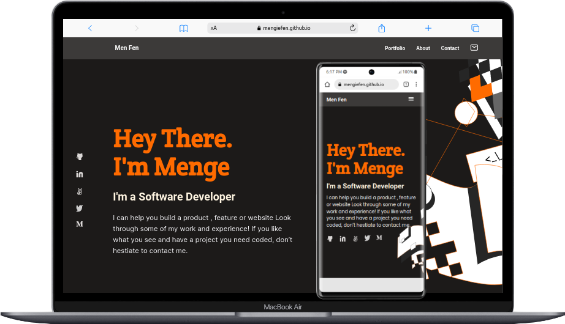

  

## List of my projects

- ### Portfolio website

<h4 align="center"><a href= 'https://mengiefen.github.io/personal-portfolio/'  > DEMO PORTFOLIO LIVE DEMO</a> </h4>
<h4 align="center"><a href= 'https://github.com/mengiefen/personal-portfolio/'> Link to source code</a> </h4>
   

- ### Bamen Website

<h4 align="center"><a href= 'https://mengiefen.github.io/microverse-capstone-01/'  > BAMEN WEBSITE LIVE DEMO</a> </h4>

<h4 align="center"><a href= 'https://github.com/mengiefen/microverse-capstone-01/'> Link to source code</a> </h4>
   

- ### Awesome Books

<h4 align="center"><a href= 'https://mengiefen.github.io/awesome-books-es6/'  > AWESOME BOOKS LIVE DEMO</a> </h4>
<h4 align="center"><a href= 'https://github.com/mengiefen/awesome-books-es6/'> Link to source code</a> </h4>

   

- ### Todo-list 

<h4 align="center"><a href= 'https://mengiefen.github.io/todo-list/'  > TODO-LIST LIVE DEMO</a> </h4>
<h4 align="center"><a href= 'https://github.com/mengiefen/todo-list/'> Link to source code</a> </h4>
   

- ### MathMagician 

<h4 align="center"><a href= 'https://mengiefen.github.io/MathMagician-React/'> MathMagician LIVE DEMO</a> </h4>
<h4 align="center"><a href= 'https://github.com/mengiefen/MathMagician-React'> Link to source code</a> </h4>
   

- ### LeaderBoard App 

<h4 align="center"><a href= 'https://mengiefen.github.io/leaderboard-list-app/'> LeaderBoard App  LIVE DEMO</a> </h4>
<h4 align="center"><a href= 'https://github.com/mengiefen/leaderboard-list-app/'> Link to source code</a> </h4>
   

- ### TodoList React

<h4 align="left"><a href= 'https://github.com/mengiefen/react-todo-app'> Todo App Live Demo </a> </h4>
<h4 align="left"><a href= 'https://mengiefen.github.io/react-todo-app/'> Link to source code</a> </h4>
   

- ### CMS Book Store 

<h4 align="center"><a href= 'https://mengiefen.github.io/book-store-react-redux/'>CMS Book Store Live Demo </a> </h4>
<h4 align="center"><a href= 'https://github.com/mengiefen/book-store-react-redux'> Link to source code</a> </h4>
   

- ### Covid Info Center

<h4 align="center"><a href= 'https://mengiefen.github.io/covid19-info-center/'>Covid Info Center Live Demo </a> </h4>
<h4 align="center"><a href= 'https://github.com/mengiefen/covid19-info-center'> Link to source code</a> </h4>
   

- ### Blog Rails App

<h4 align="center"><a href= 'https://github.com/mengiefen/blog-app'>Blog App Center Live Demo </a> </h4>
<h4 align="center"><a href= 'https://github.com/mengiefen/blog-app'> Link to source code</a> </h4>
   

- ### Blog Rails App

<h4 align="center"><a href= 'https://glacial-stream-24558.herokuapp.com/'>Recipe App Center Live Demo </a> </h4>
<h4 align="center"><a href= 'https://github.com/mengiefen/recipe-app'> Link to source code</a> </h4>
   

- ### Utility Payment Rails App

<h4 align="center"><a href= 'https://sheltered-reef-51558.herokuapp.com/home'>Utility App Center Live Demo </a> </h4>
<h4 align="center"><a href= 'https://github.com/mengiefen/utility-app'> Link to source code</a> </h4>
   

